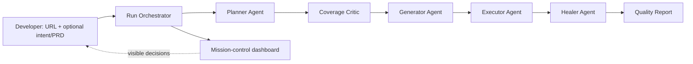

# Sentinel - Autonomous Test Orchestration Agent

Sentinel turns one web application URL into an explainable QA mission. It plans meaningful flows, critiques its own coverage, generates executable Playwright-shaped tests, runs a demo suite, diagnoses failures, heals locator drift, and presents the decision trail in a polished local dashboard.

This is a hackathon prototype, intentionally optimised for a credible three-minute demonstration rather than deployment. It directly addresses the brief's required lifecycle: URL input, planning, coverage evaluation, test generation with selector status, execution, healing, and a final quality report.

## Fastest demo

```bash
npm install
npm test
npm run dev
```

Open `http://localhost:3000`, leave **Showcase mode** on, and select **Launch test mission**. The deterministic run completes with four scenarios, an explicit stale selector, a confident `broken-test-script` classification, and a healed test. It takes well under a second and needs no API key, browser download, login, or network target.

With a provider key and Chromium configured, run `npm run smoke:live` for a terminal-only live-planning smoke test against SauceDemo. It requires a real API call and succeeds only when the Planner reports `structured-llm`.

## Team setup for a real target

1. Use Node 18 or newer and install dependencies with `npm install`.
2. Download the browser used by the optional live explorer: `npx playwright install chromium`.
3. Start the local workbench: `npm run dev`.
4. To use an LLM plan, configure one provider in `.env`. For OpenCode Go, set `OPENCODE_GO_API_KEY` and optionally `LLM_MODEL=kimi-k2.7-code`; Sentinel uses its compatible endpoint automatically. For general OpenCode inference, set `OPENCODE_API_KEY` and optionally `LLM_MODEL=kimi-k2.5`; if the value is an OpenCode user-session token rather than a service-account key, also set `OPENCODE_ORG_ID`. For another OpenAI-compatible provider, set `LLM_API_KEY`, `LLM_BASE_URL`, and `LLM_MODEL`. Direct OpenAI remains supported through `OPENAI_API_KEY` and optional `OPENAI_MODEL`. Disable Showcase mode, provide an HTTPS URL, and, when required, add target-specific credentials/configuration before executing meaningful mutations.

Do not paste credentials into the dashboard or commit them. Keep them in a local `.env` file excluded by `.gitignore`. This prototype does not currently persist credentials or screenshots.

## What is real today

| Capability | Showcase mode | Live target mode |
| --- | --- | --- |
| URL-only run start | Yes | Yes |
| Planner and human-readable plan | Deterministic demo target | DOM snapshot-based baseline |
| Coverage critique / optional PRD gaps | Yes | Yes |
| Generated test source and selector status | Yes | Yes |
| Execution and healing | Deterministic end-to-end proof | SauceDemo runs live login/cart/checkout/logout; other targets are blocked until configured |
| Decision dashboard / quality report | Yes | Yes |

The honest demo story is: *we have a complete, inspectable autonomous loop, and use an intentionally reproducible checkout fixture to demonstrate successful diagnosis and healing. The live adapter is isolated so we can specialise it safely for the organiser's credentials on the day.* Do not claim arbitrary-production-app execution until `ExecutorAgent` has been tailored and verified against the supplied target.

## Architecture



The orchestrator owns state transitions. Agents return plain structured objects and never call one another directly, which keeps them replaceable and easy to unit-test. `src/infrastructure/browser-explorer.js` is the single browser boundary; replace it, or add an LLM adapter, without changing the UI or orchestration logic.

When a configured provider is available, Planner, Coverage Critic, Generator, and Healer each make an independent structured LLM call. Their JSON is validated at the boundary; a deterministic fallback is visible in the terminal whenever a provider response is unavailable or invalid.

## Repository map

```text
server/                 HTTP + Server-Sent Events API
src/orchestrator/       pipeline state machine
src/agents/             Planner, Critic, Generator, Executor, Healer
src/domain/             input and plan contracts
src/infrastructure/     browser boundary
web/                    presentation-ready local dashboard
test/                   fast deterministic contract test
docs/                   PRD, architecture, test matrix, per-agent guides
```

## API contract

`POST /api/runs` accepts `{ url, intent?, prd?, demoMode }` and returns a run id. `GET /api/runs/:id/events` is a Server-Sent Events stream. Event names form the stable integration surface: `stage.started`, `planner.plan-ready`, `critic.coverage-reviewed`, `generator.tests-ready`, `executor.results-ready`, `healer.interventions-ready`, and `report.ready`.

## Suggested six-hour roles

| Person | First responsibility | Definition of done |
| --- | --- | --- |
| 1 | Demo owner / UI | Practices the three-minute narrative and collects screenshots/video |
| 2 | Target explorer | Maps official target flows, credentials, test accounts, and stable selectors |
| 3 | Executor + healer | Replaces the live placeholder with target-specific safe actions and validates repair paths |
| 4 | Product / presentation | Refines PRD traceability, architecture deck, business impact, and README |

## Scope boundary

Excluded by the challenge - and intentionally not built - are deployment, CI/CD, a cross-browser matrix, exhaustive production coverage, and hand-authored final test behaviour. Generated source is shown as an artefact of the agent pipeline; fixture content exists only to make the local showcase deterministic.

Read [the detailed product requirements](/home/kirin/Documents/ChatGPT/New%20project/docs/PRD.md), [architecture notes](/home/kirin/Documents/ChatGPT/New%20project/docs/ARCHITECTURE.md), [test cases](/home/kirin/Documents/ChatGPT/New%20project/docs/TEST_CASES.md), and the individual agent guides in `docs/agents/` before modifying a stage.
