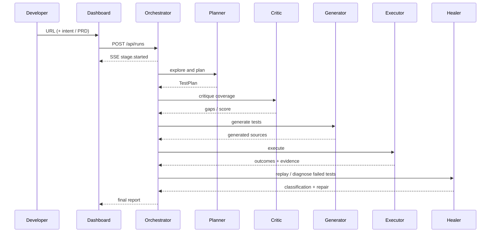

# Architecture and Design Decisions

## Design principles

**Observable autonomy.** The dashboard exposes stage transitions and decisions; agents do not silently make a claim.

**Contracts over prompts.** `src/domain/schemas.js` validates run input and test plans. Replacing deterministic logic with a model must preserve this boundary.

**One-directional orchestration.** The `RunOrchestrator` is the only component that advances the pipeline. Agents return outputs rather than recursively invoking peers, preventing loops that are hard to demo or debug.

**Safe extensibility.** Browser access is restricted to one adapter. The Executor is intentionally the seam to configure official test data and idempotent target actions.

## Sequence

## Failure classification rubric

| Signal | Classification | Action |
| --- | --- | --- |
| Locator resolves to zero; equivalent labelled control exists; assertion has no product evidence | Broken test script | Repair locator, replay, record before/after |
| Selector works; observed UI/network error contradicts expected behaviour | Likely application defect | Preserve evidence, do not change test expectation, escalate |
| Target inaccessible, credentials unavailable, or safety guard blocks action | Inconclusive | Mark blocked and request configuration |

The rubric makes the bonus classification legible and avoids the common failure mode of “healing” a genuine defect by weakening an assertion.

## Local interfaces

`POST /api/runs` begins an in-memory mission; no database or hosting is required. Server-Sent Events stream exactly the evidence needed by the presentation UI. Runs disappear when the process stops by design, avoiding accidental persistence of product data.
